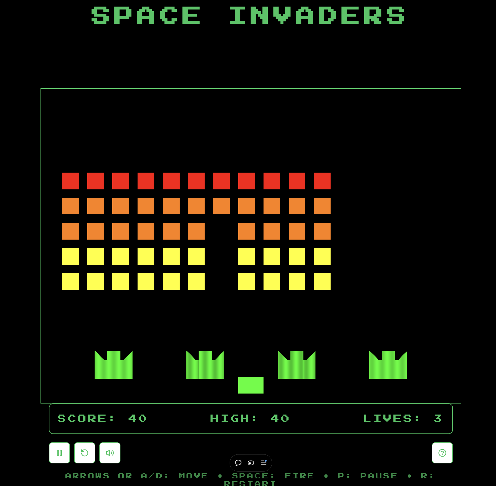

# 🚀 Open Invaders

A modern, open-source remake of the classic Space Invaders arcade game built with cutting-edge web technologies. Features stunning visual effects, AI-powered tactical advice, and responsive design for all devices.

**[▶️ Play Now](https://openinvaders.vercel.app/)**

<p align="center">
  
</p>

---

## ✨ Features

### Gameplay

- 🎮 **Classic arcade gameplay** - Authentic Space Invaders mechanics
- 🌊 **Progressive wave system** - Increasing difficulty as you advance
- 🛡️ **Destructible pixel barriers** - Strategic cover that degrades realistically
- 👾 **Multiple alien types** - Different enemies with varying point values
- 🛸 **Mystery UFO** - Bonus scoring opportunities
- 💥 **Combo system** - Chain kills for bonus points
- 🏆 **Persistent high scores** - Local storage saves your best score

### Visual Effects

- ⭐ **Parallax starfield** - Twinkling background stars
- 💫 **Particle explosions** - Dynamic debris and spark effects
- 📺 **CRT screen effects** - Scanlines and vignette for retro feel
- 🌈 **Glow effects** - Neon-style entity rendering
- 📳 **Screen shake** - Impactful feedback on hits

### AI Integration

- 🤖 **AI Tactical Advisor** - Real-time gameplay tips powered by GPT-4o
- 💬 **Context-aware advice** - Responds to wave changes, damage taken, and more

### Technical

- 📱 **Fully responsive** - Touch controls for mobile, keyboard for desktop
- 🔊 **8-bit sound effects** - Embedded base64 audio (no external files)
- ⚡ **60 FPS gameplay** - Smooth canvas rendering with optimized game loop
- 🎯 **Pixel-perfect collision** - Accurate hitbox detection

---

## 🛠️ Technology Stack

| Category             | Technology                                      | Version |
| -------------------- | ----------------------------------------------- | ------- |
| **Framework**        | [Next.js](https://nextjs.org/)                  | 16.1.1  |
| **Language**         | [TypeScript](https://www.typescriptlang.org/)   | 5.9.3   |
| **UI Library**       | [React](https://react.dev/)                     | 19.2.3  |
| **Styling**          | [Tailwind CSS](https://tailwindcss.com/)        | 4.1.18  |
| **State Management** | [Zustand](https://zustand-demo.pmnd.rs/)        | 5.0.9   |
| **Animations**       | [Framer Motion](https://www.framer.com/motion/) | 12.23.26 |
| **AI SDK**           | [Vercel AI SDK](https://sdk.vercel.ai/)         | 6.0.3   |
| **UI Components**    | [Radix UI](https://www.radix-ui.com/)           | 1.1.x   |
| **Icons**            | [Lucide React](https://lucide.dev/)             | 0.562.0 |
| **Rendering**        | HTML5 Canvas                                    | -       |

---

## 🚀 Getting Started

### Prerequisites

- **Node.js** 20.9.0 or later
- **npm**, **yarn**, or **pnpm** package manager
- **OpenAI API key** (optional, for AI tactical advisor)

### Installation

1. **Clone the repository:**

   ```bash
   git clone https://github.com/brown2020/openinvaders.git
   cd openinvaders
   ```

2. **Install dependencies:**

   ```bash
   npm install
   # or
   yarn install
   # or
   pnpm install
   ```

3. **Set up environment variables (optional):**

   Create a `.env.local` file for the AI tactical advisor feature:

   ```bash
   # Copy the template
   echo "OPENAI_API_KEY=sk-your_key_here" > .env.local
   ```

   Get your API key from [OpenAI Platform](https://platform.openai.com/api-keys):

   ```env
   OPENAI_API_KEY=sk-your_openai_api_key_here
   ```

   > **Note:** The game works fully without an API key—the AI advisor simply won't appear.

4. **Start the development server:**

   ```bash
   npm run dev
   ```

5. **Open [http://localhost:3000](http://localhost:3000)** and play!

### Build for Production

```bash
npm run build
npm run start
```

---

## 🎮 Game Controls

### Desktop

| Key                | Action            |
| ------------------ | ----------------- |
| `←` `→` or `A` `D` | Move left/right   |
| `Space`            | Fire / Start game |
| `P`                | Pause/Resume      |
| `R`                | Restart game      |
| `Escape`           | Pause             |

### Mobile

- **Touch buttons** for movement and shooting
- **On-screen controls** for pause, sound toggle, and help

---

## 📁 Project Structure

```
openinvaders/
├── src/
│   ├── app/                      # Next.js App Router
│   │   ├── api/
│   │   │   └── completion/       # AI advisor API route
│   │   ├── layout.tsx            # Root layout with fonts
│   │   ├── page.tsx              # Main game page
│   │   └── globals.css           # Global styles & animations
│   │
│   ├── components/
│   │   ├── game/                 # Game components
│   │   │   ├── Game.tsx          # Main game container
│   │   │   ├── GameCanvas.tsx    # Canvas renderer
│   │   │   ├── GameControls.tsx  # Input handling
│   │   │   ├── GameHUD.tsx       # Score/lives display
│   │   │   ├── GameOverlay.tsx   # Menu/pause/game over
│   │   │   ├── TacticalAdvisor.tsx # AI advisor component
│   │   │   ├── ScoreNotification.tsx # Floating score popups
│   │   │   └── AlienIcon.tsx     # SVG alien sprites
│   │   └── ui/                   # Reusable UI components
│   │       ├── button.tsx
│   │       └── dialog.tsx
│   │
│   ├── hooks/
│   │   └── useGameEngine.ts      # Core game loop hook
│   │
│   ├── lib/
│   │   ├── constants/            # Game configuration
│   │   │   ├── game.ts           # Dimensions, speeds, etc.
│   │   │   ├── colors.ts         # Color palette
│   │   │   └── effects.ts        # Particle/effect settings
│   │   ├── entities/             # Game entity classes
│   │   │   ├── entity.ts         # Base entity class
│   │   │   ├── player.ts         # Player ship
│   │   │   ├── alien.ts          # Alien enemies
│   │   │   ├── projectile.ts     # Bullets
│   │   │   ├── barrier.ts        # Destructible shields
│   │   │   └── ufo.ts            # Mystery bonus ship
│   │   ├── effects/              # Visual effects
│   │   │   ├── ParticleSystem.ts # Explosion particles
│   │   │   ├── ScreenEffects.ts  # Shake & CRT effects
│   │   │   └── Starfield.ts      # Background stars
│   │   ├── game/                 # Game systems
│   │   │   ├── EntityManager.ts  # Entity lifecycle
│   │   │   └── CollisionManager.ts # Hit detection
│   │   ├── sounds/               # Audio system
│   │   │   ├── SoundManager.ts   # Sound playback
│   │   │   └── SoundTypes.ts     # Sound enum
│   │   ├── store/
│   │   │   └── game-store.ts     # Zustand state store
│   │   └── utils/                # Utility functions
│   │       ├── canvas.ts         # Rendering helpers
│   │       └── color.ts          # Color manipulation
│   │
│   └── types/
│       └── game.ts               # TypeScript definitions
│
├── public/
│   └── screenshot.png            # Game screenshot
├── .eslintrc.json                # ESLint configuration
├── .gitignore                    # Git ignore rules
├── components.json               # shadcn/ui config
├── next.config.mjs               # Next.js configuration
├── package.json                  # Dependencies & scripts
├── postcss.config.mjs            # PostCSS configuration
├── tsconfig.json                 # TypeScript configuration
└── ENV_TEMPLATE.md               # Environment variable template
```

---

## 🎯 Game Mechanics

### Scoring System

| Enemy                      | Points          |
| -------------------------- | --------------- |
| Bottom row aliens (yellow) | 10              |
| Middle row aliens (orange) | 20              |
| Top row aliens (pink)      | 30              |
| Mystery UFO                | 50–300 (random) |

**Combo Bonus:** Chain kills within 1 second for up to 10x multiplier!

### Wave Progression

- Aliens speed up as their numbers decrease
- Each wave increases alien aggression
- Barriers regenerate between waves
- UFO appears randomly every 10–25 seconds

---

## 🔧 Configuration

Game constants can be adjusted in `src/lib/constants/`:

### `game.ts`

- Canvas dimensions (800×600)
- Player speed and shoot cooldown
- Alien formation, spacing, and behavior
- Projectile speeds and limits
- UFO spawn timing and scores

### `colors.ts`

- Entity colors
- UI color palette
- Explosion particle colors

### `effects.ts`

- Particle physics (gravity, friction)
- Starfield layers and twinkling
- Screen shake intensity
- CRT effect opacity

---

## 🚢 Deployment

### Vercel (Recommended)

The game is deployed at [openinvaders.vercel.app](https://openinvaders.vercel.app/).

To deploy your own:

1. Fork this repository
2. Create a new project on [Vercel](https://vercel.com)
3. Connect your fork
4. Add `OPENAI_API_KEY` to environment variables (optional)
5. Deploy!

### Other Platforms

Works with any platform supporting Next.js:

- **Netlify**: Use the Next.js adapter
- **AWS Amplify**: Native Next.js support
- **Docker**: Use the [Next.js Docker example](https://github.com/vercel/next.js/tree/canary/examples/with-docker)

---

## 🤝 Contributing

Contributions are welcome! Here's how to get started:

1. **Fork** the repository
2. **Create** a feature branch: `git checkout -b feature/amazing-feature`
3. **Commit** your changes: `git commit -m 'Add amazing feature'`
4. **Push** to the branch: `git push origin feature/amazing-feature`
5. **Open** a Pull Request

### Development Guidelines

- Follow the existing code style (TypeScript strict mode)
- Use functional components and hooks
- Keep game logic in `lib/`, UI in `components/`
- Add types to `types/game.ts` for new features
- Test on both desktop and mobile

### Ideas for Contribution

- 🎵 Background music
- 🏅 Online leaderboard
- 🎨 Additional visual themes
- 📊 Statistics tracking
- 🎮 Gamepad support
- 🌐 Multiplayer mode

---

## 📄 License

This project is licensed under the **GNU Affero General Public License v3.0 (AGPL-3.0)** - see the [LICENSE](LICENSE.md) file for details.

---

## 🙏 Acknowledgments

- **Tomohiro Nishikado** - Original Space Invaders creator (1978)
- **Vercel** - Next.js and AI SDK
- **Tailwind Labs** - Tailwind CSS
- **Open source community** - All the amazing libraries used

---

## 📬 Contact

- **Email:** [info@ignitechannel.com](mailto:info@ignitechannel.com)
- **GitHub Issues:** [Report bugs or request features](https://github.com/brown2020/openinvaders/issues)

---

## ⭐ Support

If you enjoy this project:

- ⭐ **Star** the repository
- 🐦 **Share** on social media
- 🐛 **Report** issues
- 💡 **Suggest** features
- 🔀 **Contribute** code

---

<div align="center">
  <sub>Built with ❤️ using Next.js 16.1, React 19.2, and Tailwind CSS 4.1</sub>
</div>
